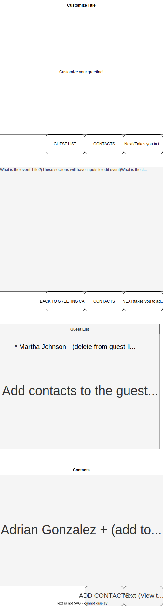
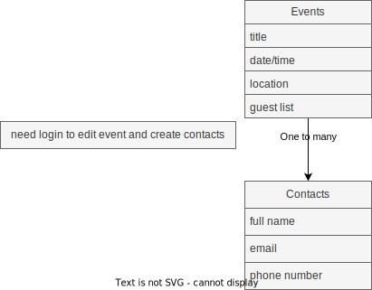
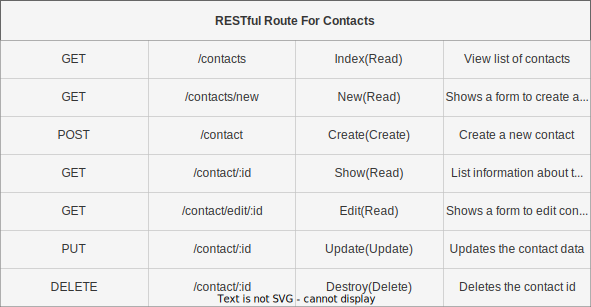

# EventEasy - Your Ultimate Event Planning App! 

Are you tired of the hassle of organizing events and struggling to keep track of your guest list? Look no further! Get ready to experience the power of "EventEasy" - the revolutionary app that takes event planning to a whole new level!

## Plan Events with Ease:
With "EventEasy," creating events has never been simpler! Whether it's a birthday bash, a wedding reception, a corporate conference, or a casual get-together, our user-friendly interface allows you to set up events effortlessly.

## Technologies Being Used:
* JavaScript
* HTML
* CSS
* Node.js

## Wireframes, ERDs and User Stories:

### Views

### ERDs

<strong> The same chart will exist for the creation of the invited guest list </strong>

### User Stories

## MVP Goals/Stretch Goals