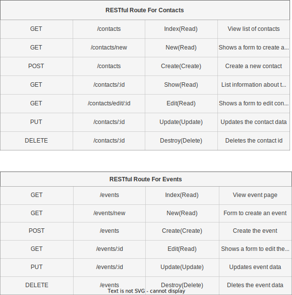

# EventEasy - Your Ultimate Event Planning App! 

Are you tired of the hassle of organizing events and struggling to keep track of your guest list? Look no further! Get ready to experience the power of "EventEasy" - the revolutionary app that takes event planning to a whole new level!

## Plan Events with Ease:
With "EventEasy," creating events has never been simpler! Whether it's a birthday bash, a wedding reception, a corporate conference, or a casual get-together, our user-friendly interface allows you to set up events effortlessly.

## Technologies Being Used:
* JavaScript
* HTML
* CSS
* Node.js

## Wireframes, ERDs and User Stories:

### Views

### ERDs

  

### User Stories
1. As a user, I want to create events with date, time, and location so that I can invite my contacts and plan for a successful gathering.

2. As a user, I want the ability to personalize event invitations with themes and custom messages, making my events more appealing and memorable.

3. As a user, I want to have a user-friendly interface that is easy to navigate, allowing me to quickly create and manage events without any technical hurdles.

4. As a user, I want to be able to see the list of guests on the invite list.
## MVP Goals/Stretch Goals:

### MVP Goals
* Authorization will be needed to create and update event data, add contacts and make an invite list
* Create and update event data
* Create and update contacts
* View the send page that sends the invites out

### Stretch Goals
* Customize an invite card
* Send real invites to real contact numbers
* Create a new list of guests who have RSVP
* If a guest RSVPs then automatically update the list of guests